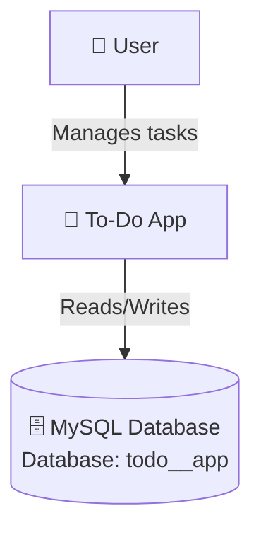
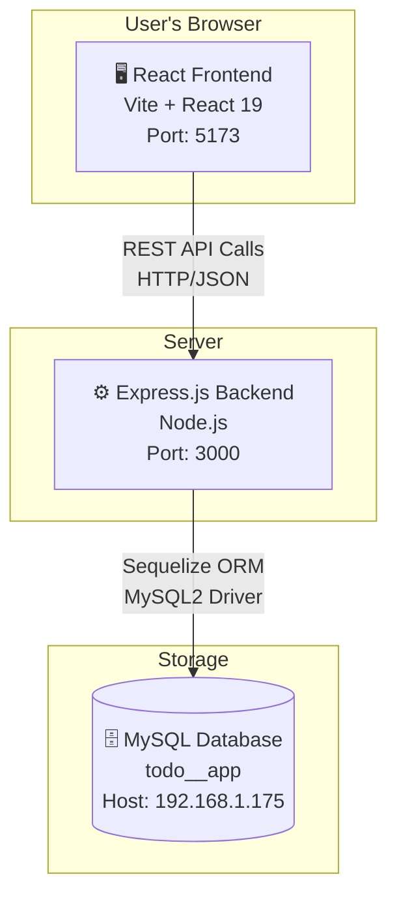
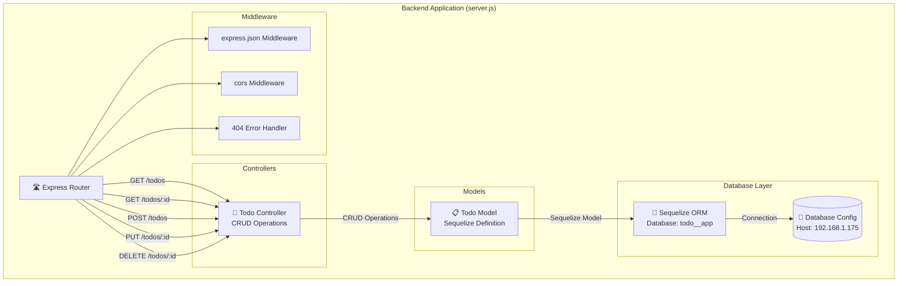

# 🏗️ C4 Architecture Documentation - To-Do App

## 📊 Technology Stack

- **Frontend**: React 19 + Vite
- **Backend**: Node.js + Express 5
- **ORM**: Sequelize 6
- **Database**: MySQL
- **Ports**: Frontend (5173), Backend (3000)

---

## Level 1: System Context Diagram

Shows who interacts with the system.



---

## Level 2: Container Diagram

Shows the high-level technology choices with exact ports.



---

## Level 3: Component Diagram (Backend)

Shows the internal structure of your backend based on actual `server.js`.



---

## Level 4: Code/Entity Diagram (Database Schema)

Shows your actual database structure based on `server.js`.

```mermaid
erDiagram
    TODO {
        INT id PK
        VARCHAR(255) title
        BOOLEAN is_completed
    }
````
